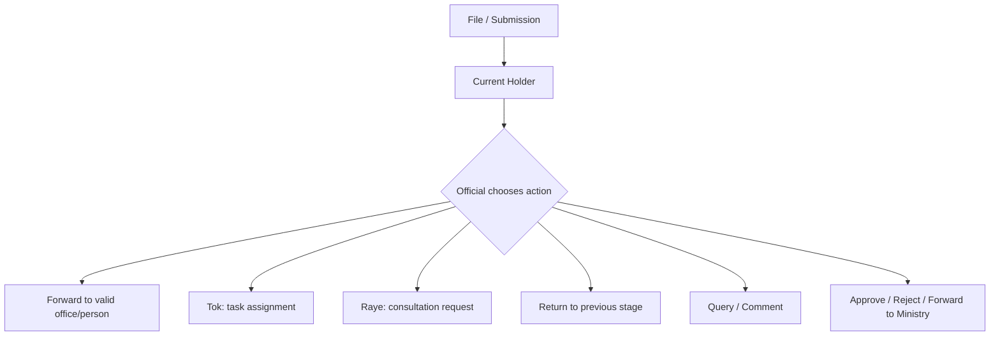

I studied `Readme/DOR file.xlsx`. The important conclusion is: DOR should not be modeled as one rigid linear workflow. It should be modeled as a **controlled file-routing system** where workflow type defines rules, required documents, thresholds, and allowed actions, but DOR officials choose the next valid destination from inside the file.

**What The Workbook Shows**
The org structure is five-level:

1. Ministry of Infrastructure Development
2. Department of Roads
3. Divisions / Directorates / HQ units
4. FRSMOs, bridge sectors, HEDs, project directorates, sakhas
5. Road divisions, project offices, mechanical offices

Personnel hierarchy is not only vertical. It has authority levels and functional tracks:

- Authority chain: `DG -> DDG -> Superintending Engineer -> SDE -> Engineer -> Sub Engineer`
- Functional sakhas: `Prabidhik`, `Prasasan`, `Lekha`, `Kaanun`
- Office-specific staff templates: Road Division, FRSMO, Project Directorate, Project Office, HQ unit, etc.

The sample VO workflow is flexible:
- Contractor submits VO
- Entry desk receives
- SDE office admin can Tok to an engineer
- Engineer can assign Sub Engineer, reject, comment, prepare Tippani, forward
- SDE can Tok/Raye/query/return/reject/approve/forward
- SE can do the same, with threshold authority
- DDG/DG can Tok/Raye/query/return/reject/approve/forward to ministry

Thresholds are rules, not rigid stage order:
- VO `< 10%`: SDE can approve
- VO `>= 10%`: must escalate to SE
- VO `< 15%`: SE can approve
- VO `>= 15%`: must escalate higher

**Recommended App Model**
Keep `WorkflowDefinition`, but make it a **case policy**, not a fixed route.

A workflow should define:
- Required metadata: `vo_percentage`, contract number, amount
- Required documents: Tippani, attachments
- Authority thresholds
- Allowed actions by role/designation
- Which destination groups are valid
- Terminal conditions

The actual movement should be dynamic:



**How To Implement Without Rigid Workflows**
Use a server-side **routing policy engine**.

Instead of hardcoding “next stage = stageOrder + 1”, compute valid next destinations from:

- Current user role/designation
- Current office and parent/child offices
- File type
- File metadata, especially `vo_percentage`
- Current file holder
- Workflow action rules
- DOR hierarchy graph

The UI should not let users manually type arbitrary targets. It should call something like:

```http
GET /api/submissions/:id/available-actions
```

Response example:

```json
{
  "actions": [
    {
      "action": "FORWARD",
      "label": "Forward to Superintending Engineer",
      "targets": [
        {
          "officeId": "FRSMO-KTM",
          "role": "SUPERINTENDENT_ENGINEER",
          "reason": "VO percentage is >= 10%"
        }
      ]
    },
    {
      "action": "RAYE",
      "targets": ["LEKHA", "PRASASAN", "PRABIDHIK"]
    },
    {
      "action": "TOK",
      "targets": ["ENGINEER", "SUB_ENGINEER", "ACCOUNT_OFFICER"]
    },
    {
      "action": "RETURN",
      "targets": ["Engineer", "Entry Desk"]
    }
  ]
}
```

Then the official chooses from server-approved options.

**Data Model Direction**
Your current app already has many of the right pieces: branches, parent branches, current branch, dynamic `targetStageId`, Tok, Raye, Tippani, and routing rules.

I would evolve it like this:

- `branches`: continue as DOR offices, with `branchLevel`, `parentBranchId`, `clusterType`
- `users`: add/keep `designation`, `role`, `branchId`, `departmentId`
- Add or formalize `office_type`: `ROAD_DIVISION`, `FRSMO`, `HQ_MAHASAKHA`, `PROJECT_OFFICE`, etc.
- Add `position_track`: `PRABIDHIK`, `PRASASAN`, `LEKHA`, `KAANUN`
- Treat `file_stages` as movement history, not just fixed workflow stages
- Add `available_action_policy` or config JSON per workflow
- Keep `tok_assignments` and `raye_requests` as subtasks attached to current file stage

**Best UX**
Inside a file detail page, officials should see action buttons:

- `Forward`
- `Tok`
- `Request Raye`
- `Return`
- `Query`
- `Approve`
- `Reject`
- `Forward to Ministry`

When clicking `Forward`, the app should show computed destinations:

- Recommended next authority
- Parent office authority
- Same-office officer
- HQ division
- Ministry, only when allowed

This gives DOR officials flexibility while keeping government-grade control and auditability.

**Main Rule**
Do not make 20 rigid DOR workflows. Make **workflow templates + dynamic routing policies**.

The workflow says what is allowed.  
The DOR official chooses where to send it.  
The server verifies that choice against hierarchy, role, threshold, and file state.